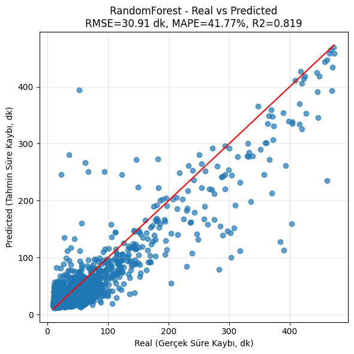
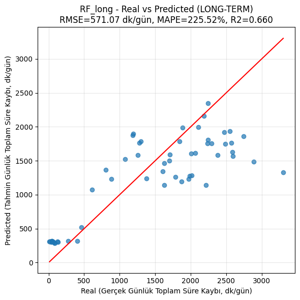

# An-integrated-approach-based-on-machine-learning-LLM-for-downtime-duration-prediction

### Machine learning is widely used in manufacturing to improve efficiency and predict downtime durations, while large language models (LLMs) have become an important tool for root-cause analysis and explainability. This study develops an LLM-based interpretation module that explains possible root causes of production downtimes, alongside machine learning models that predict downtime duration. Production records were preprocessed and features were extracted. Using variables such as mold number and machine name, Random Forest, XGBoost, Artificial Neural Networks (ANN), and Decision Trees were trained with hyperparameter optimization. Performance was evaluated using RMSE, MAE, MAPE, and R². For short-term downtime prediction, the best XGBoost model achieved RMSE 30.57, MAE 16.75, MAPE 40%, and R² 0.82. Prediction uncertainty was reported as approximate confidence intervals and model confidence percentages: for Random Forest it was derived from the distribution across trees, while for the other methods it was approximated from the global RMSE. Qwen2.5-1.5B-Instruct and TinyLlama-1.1B-Chat generated Turkish root-cause explanations using a few-shot prompt built from part code, machine name, and statistical summaries of historical downtime names.
### For quantitative evaluation, downtime names mentioned in the generated text were compared with the top three true downtime causes for the same part/machine/mold combination; precision, recall, and F1 scores were computed. Large language models confidence was labeled as low, medium, or high based on the F1 score.### The LLM component was used as a question–answer engine: using partial code-combination outputs from the machine learning models, the system queried and interpreted prediction results and generated responses. Subsequently, when provided with the duration values of 18 causes at the part-code combination level, it reported the top three root-cause selections with perfect accuracy. In addition, by constraining the model with a predefined cause/action list, no out-of-pool action generation was observed in the recommendations. From an operational benefit perspective, at least one of the first two suggested actions was always correct.The moderate Action F1 score (0.586) can be explained by  limiting the number of recommended actions to 1–2 and (ii) defining the action set broadly while keeping its size relatively constrained, which naturally limits the recall component—especially when the system is forced to output only a small number of actions.

                            

### It has been demonstrated that a two-layer decision support approach (ML prediction + LLM) can produce feasible and consistent outputs for the downtime-duration problem. In the short term, the best predictive performance was achieved with the XGBoost model, while in the long term (daily aggregated setting) the best performance was obtained with Random Forest. This finding indicates that, in the short term, boosting methods are stronger at capturing variability, whereas in the long term, for an aggregated target, the bagging approach yields more stable results.

### The LLM component was used as a question–answer engine: using partial code-combination outputs from the machine learning models, the system queried and interpreted prediction results and generated responses. Subsequently, when provided with the duration values of 18 causes at the part-code combination level, it reported the top three root-cause selections with perfect accuracy. In addition, by constraining the model with a predefined cause/action list, no out-of-pool action generation was observed in the recommendations. From an operational benefit perspective, at least one of the first two suggested actions was always correct.

### The moderate Action F1 score (0.586) can be explained by  limiting the number of recommended actions to 1–2 and (ii) defining the action set broadly while keeping its size relatively constrained, which naturally limits the recall component—especially when the system is forced to output only a small number of actions.
